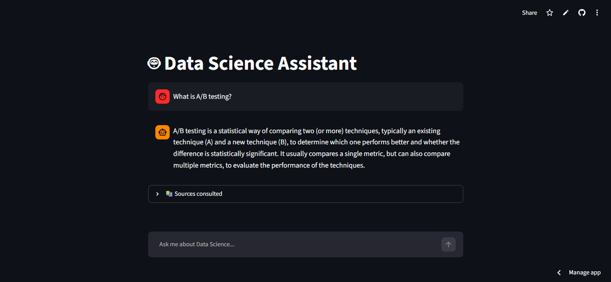
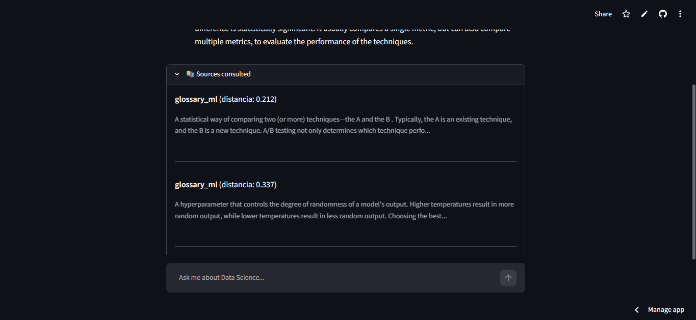
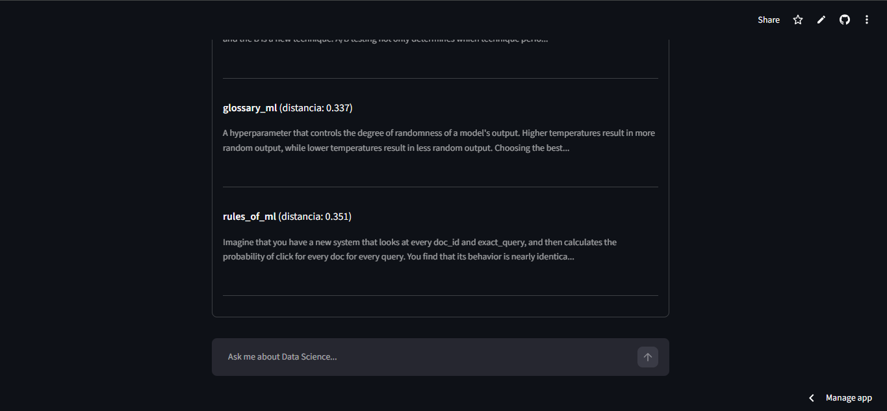
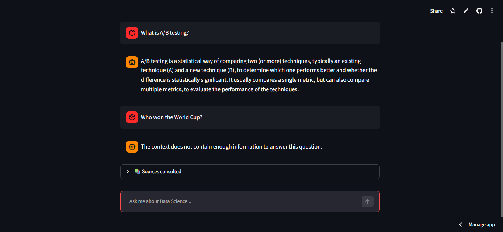

# Data Science RAG Assistant

A conversational assistant that answers Data Science questions using Retrieval-Augmented Generation (RAG) over a curated knowledge base, powered by the Groq API for fast, free-tier LLM inference.

**Repository:** [github.com/simobote0355/data-science-rag](https://github.com/simobote0355/data-science-rag)
**Live demo:** [data-science-rag.streamlit.app](https://data-science-rag.streamlit.app/)

## Problem Statement

General-purpose LLMs are fluent but ungrounded: ask one a question about a specific methodology or a niche metric and it will answer confidently even when it's wrong, because it has no way to check itself against a source. This is a real problem for anyone trying to use an LLM as a study aid or reference tool for a well-defined body of knowledge — you can't tell hallucination from fact without independently verifying every answer.

This project addresses that by narrowing the assistant's world to four curated Data Science references and forcing it to answer *from* that material rather than *around* it. When a question falls outside the knowledge base, the assistant says so explicitly instead of falling back on the model's general (and unverifiable, for this purpose) knowledge. The project also doubles as a hands-on introduction to RAG architecture for someone coming from a data engineering / analytics background rather than an NLP one.

## Description

This project combines two skills: consuming an external API and building a RAG pipeline from scratch. Instead of relying on the LLM's general knowledge, the assistant retrieves relevant passages from a small, curated knowledge base and grounds its answers in that retrieved context — reducing hallucination and making its reasoning traceable back to a source.

The knowledge base covers four foundational Data Science / ML references:

- [Google's Machine Learning Glossary](https://developers.google.com/machine-learning/glossary)
- [scikit-learn's Model Evaluation documentation](https://scikit-learn.org/stable/modules/model_evaluation.html)
- [Google's Rules of Machine Learning](https://developers.google.com/machine-learning/guides/rules-of-ml)
- [GeeksforGeeks' Feature Engineering article](https://www.geeksforgeeks.org/machine-learning/what-is-feature-engineering/)

The entire stack was chosen with one hard constraint: **zero cost and zero risk of surprise billing**. Every component runs on a free tier or fully locally.

## Features

- **Retrieval-Augmented Generation**: answers are grounded in retrieved context rather than the model's parametric knowledge.
- **Out-of-domain detection**: when a question falls outside the knowledge base, the assistant explicitly says so instead of improvising an answer.
- **Source transparency**: every response shows which document chunks were retrieved and how relevant they were (embedding distance), so answers can be traced back to their source.
- **Streaming responses**: answers are streamed token-by-token in the Streamlit UI for a more responsive feel.
- **Conversational memory**: the chat retains context across turns within a session.
- **Two interfaces**: an interactive Streamlit web app and a lightweight CLI, for quick local testing without spinning up a server.
- **Resilient ingestion pipeline**: scraping failures on one source don't halt ingestion of the others.

## Technologies

| Category | Choice | Why |
|---|---|---|
| LLM inference | [Groq API](https://groq.com/) (`llama-3.3-70b-versatile`) | Free tier, very low latency, no quota-billing surprises |
| Embeddings | [sentence-transformers](https://www.sbert.net/) (`intfloat/e5-small-v2`) | Runs 100% locally — no API cost or quota risk; monolingual English model, since both the sources and the assistant's Q&A are English-only |
| Vector store | [ChromaDB](https://www.trychroma.com/) (persistent, file-based) | Free, embedded, no external service to manage |
| Scraping | `requests` + `BeautifulSoup` | Standard, lightweight HTML parsing |
| Tokenization | `transformers` `AutoTokenizer` | Matches the embedding model's tokenizer for accurate chunk sizing |
| Web UI | [Streamlit](https://streamlit.io/) | Fast to build, free hosting via Streamlit Community Cloud |

## Key Technical Decisions

- **Groq over Gemini/OpenAI for generation.** A prior negative experience with unexpected Gemini API quota/billing behavior made "zero risk of surprise billing" a hard requirement for this project. Groq's free tier is generous and predictable, and `llama-3.3-70b-versatile` is strong enough for grounded Q&A at very low latency.

- **Local embeddings instead of an embeddings API.** Running `sentence-transformers` locally removes an entire category of risk (rate limits, quota, billing) for a step that runs once per document at ingestion time and once per query at runtime — cheap enough to not need a hosted API.

- **File-based ChromaDB instead of a hosted vector database.** The knowledge base is small (four documents, chunked). An embedded, file-based vector store avoids running or paying for a separate database service, and keeps the whole project deployable on free static/compute tiers.

- **Monolingual embedding model (`e5-small-v2`) over a multilingual one.** The project initially used `multilingual-e5-small` to hedge for Spanish queries against English sources. Once the decision was made to keep both the sources and the assistant's Q&A entirely in English, the multilingual model was dropped in favor of a monolingual one — same model family and prefix scheme (`"query: "` / `"passage: "`), but without the model splitting its representational capacity across languages it no longer needs to handle. This is a direct trade-off: a multilingual model would have been the *better* choice if cross-lingual retrieval (e.g., Spanish questions against English documents) were still a requirement.

- **Low temperature (0.3–0.4) for generation.** Keeps the model anchored to the retrieved context and reduces the chance it drifts into general-knowledge territory when the context is thin.

- **Structure-aware chunking over fixed-size chunking.** All four sources have clear HTML section structure (headers, nested sections), so chunks are split along semantic boundaries (sections/headers) rather than at an arbitrary character count, with a token-count threshold only used to further split unusually large sections.

## Challenges & Solutions

- **Malformed HTML in the ML Glossary.** Some headers were nested inside `<p>` tags (`<p><h2></h2></p>`) instead of being siblings of the content that followed them. Sibling-based traversal silently broke on these cases. *Solution:* detect when a header's parent is a `<p>` and navigate to that parent before doing sibling traversal, so the "next siblings" are the actual content elements.

- **Table and callout-panel contamination in scraped text.** Nested `<table>` elements and callout/key-takeaway panels were bleeding into the extracted text as noisy, unstructured fragments. *Solution:* `decompose()` unwanted nested elements before calling `get_text()`, rather than trying to clean the resulting string afterward.

- **Footer/nav noise in Rules of ML.** An unscoped search for headers picked up navigation and footer content. *Solution:* scope all searches to the specific content container (`div.devsite-article-body`) instead of searching the whole page.

- **No conversational memory in the initial Streamlit chat.** Early on, each call to the Groq API only received the latest user message, so follow-up questions failed silently (the model had no idea what "it" or "that" referred to). *Solution:* pass the full `st.session_state.messages` history to the API on every call, instead of just the newest message — the RAG system prompt is prepended to that list on the fly per turn, without being persisted into the stored history (to avoid stale context piling up across turns).

- **Sources scraped in Spanish despite being English pages.** Google Developers pages were served in Spanish because the scraper sent no language preference, and the server inferred locale on its own. *Solution:* add an explicit `Accept-Language: en-US,en;q=0.9` header to every scraping request.

- **Perceived latency of ~1.5–2s per answer.** Groq generation is already fast for a 70B model, but a blank wait before the full answer appears feels slow in a chat UI. *Solution:* stream the response token-by-token with `stream=True` on the Groq call and `st.write_stream()` in Streamlit — total latency is unchanged, but the perceived responsiveness improves substantially.

- **`Collection [knowledge_base] does not exist` on first deploy.** `knowledge_base.json` and `my_chroma_db/` were initially excluded from version control, since they're generated artifacts. On Streamlit Community Cloud, the app is deployed from a fresh clone of the repo — it never runs the local ingestion steps, so the ChromaDB collection genuinely didn't exist on the server. *Solution:* version those two artifacts instead of regenerating them on every deploy (their combined size, ~17 MB, is well within GitHub's and Streamlit Cloud's free-tier limits), so the app has everything it needs immediately on a cold start.

## Lessons Learned

- **HTML structure should be inspected before writing any parsing code** — it's the scraping equivalent of doing EDA before scaling a pipeline. Each of the four sources needed a genuinely different parsing strategy once actually inspected, despite looking similar at a glance.
- **Parser choice affects the parse tree, not just performance.** `lxml` vs. `html.parser` produced meaningfully different trees for the same malformed HTML, which changed how sibling-based traversal behaved.
- **Scoping searches to a container element is a cheap, reliable way to avoid noise** — applied consistently once discovered in one source, it prevented the same class of bug in others.
- **Embeddings from different models are not interchangeable.** Switching the embedding model requires regenerating the entire knowledge base and vector store from scratch — there's no partial migration path.
- **The tokenizer used for chunk-size decisions should match the embedding model's own tokenizer**, not an arbitrary one — otherwise token counts don't reflect how the actual embedding model will process the text.
- **Temperature is a real, testable lever for grounding**, not just a stylistic knob — worth documenting experimentally rather than just picking a number.
- **A multilingual embedding model is a deliberate choice for cross-lingual retrieval, not a safe default.** It only pays off when queries and documents are genuinely in different languages; once both sides are the same language, a monolingual model is the better fit.

## Installation

1. Clone the repository:
   ```bash
   git clone https://github.com/simobote0355/data-science-rag.git
   cd data-science-rag
   ```

2. Create and activate a virtual environment:
   ```bash
   python -m venv venv
   # Windows
   venv\Scripts\Activate.ps1
   # macOS/Linux
   source venv/bin/activate
   ```

3. Install dependencies:
   ```bash
   pip install -r requirements.txt
   ```

## Environment Variables

### Local development

Create a `.env` file in the project root with:

```
GROQ_API_KEY=your_groq_api_key_here
```

**How to get a free Groq API key:**
1. Go to [console.groq.com](https://console.groq.com/) and sign in (or create an account).
2. Go to **API Keys** in the left sidebar.
3. Click **Create API Key**, give it a name, and copy the value — it's only shown once.
4. Paste it into your `.env` file as shown above.

The key stays on the free tier by default; no billing information is required to generate one.

### Deployment (Streamlit Community Cloud)

The `.env` file is never committed (it's in `.gitignore`), so on Streamlit Community Cloud the key is provided through **Secrets** instead:

1. Open your app's dashboard at [share.streamlit.io](https://share.streamlit.io/).
2. Click the **⋮** menu on your app → **Settings** → **Secrets**.
3. Add the key in TOML format:
   ```toml
   GROQ_API_KEY = "your_groq_api_key_here"
   ```
4. Save — the app restarts automatically and picks up the new value.

No code changes are needed for this: Streamlit injects secrets as environment variables at runtime, so the existing `os.getenv("GROQ_API_KEY")` calls in `client.py` and `app.py` pick it up automatically. `load_dotenv()` simply finds no `.env` file on the server and does nothing, which is expected.

## Usage

The knowledge base (`knowledge_base.json`) and the vector store (`my_chroma_db/`) are included in this repository, so the assistant works out of the box — no ingestion step required to just run the app.

### Run the assistant

**Web app (Streamlit):**
```bash
streamlit run app.py
```

**CLI:**
```bash
python assistant_cli.py
```

### Regenerating the knowledge base (optional)

If you change a source, the chunking logic, or the embedding model, rebuild the knowledge base and vector store from scratch:

```bash
python main.py          # scraping → dedup → chunking → embeddings → knowledge_base.json
python vector_store.py  # loads knowledge_base.json into a fresh ChromaDB collection
```

Delete the existing `my_chroma_db/` folder first if you're changing the embedding model — vectors from different models aren't compatible with each other and mixing them silently breaks retrieval.

## Project Structure

```
data-science-rag/
├── app.py                  # Streamlit chat interface (streaming, memory, source display)
├── assistant_cli.py        # Lightweight CLI interface for the RAG assistant
├── chunking.py              # Tokenization and structure-aware chunk splitting
├── client.py                # Groq API client and prompt construction (used by the CLI)
├── embeddings.py             # Local embedding generation with sentence-transformers
├── main.py                  # Ingestion pipeline: scraping → dedup → chunking → embeddings
├── retrieval.py              # Query embedding + similarity search over ChromaDB
├── scraping.py               # Source-specific HTML parsing for each of the 4 sources
├── vector_store.py            # Loads knowledge_base.json into a persistent ChromaDB collection
├── knowledge_base.json         # Pre-built, chunked, embedded knowledge base (versioned for deployment)
├── my_chroma_db/                # Pre-built persistent ChromaDB collection (versioned for deployment)
├── requirements.txt
└── .gitignore
```

`knowledge_base.json` and `my_chroma_db/` are committed to the repo (rather than excluded and regenerated at deploy time) so the app works immediately on Streamlit Community Cloud without needing to scrape live sources or run the ingestion pipeline on a cold start.

## Screenshots

**Grounded Q&A** — the assistant answers using retrieved context from the knowledge base.


**Source transparency** — every answer can be traced back to the specific chunks and sources that were retrieved.



**Out-of-domain detection** — when a question falls outside the knowledge base (e.g. "who won the World Cup?"), the assistant explicitly says it doesn't have that information instead of guessing.


## API

This project doesn't expose its own API — it *consumes* one:

- **Groq API** (`/chat/completions`, OpenAI-compatible) via the official `groq` Python SDK, used for text generation in both `app.py` and `client.py`.
- No other external APIs are called at runtime; embeddings and retrieval run entirely locally.

## Future Work

- Add a similarity-distance threshold to filter out irrelevant chunks before they reach the prompt, rather than relying solely on the LLM to recognize weak context.
- Compare ChromaDB against FAISS for retrieval quality and speed.
- Add re-ranking of retrieved chunks before augmenting the prompt.
- Expand the knowledge base with additional Data Science references.
- Add a language-consistency check at ingestion time (e.g. flag any scraped chunk that isn't detected as English) to catch localization issues like the Spanish-scraping bug automatically instead of by manual inspection.

## Author

**Simón** — Data Analyst / Data Engineer transitioning into ML-adjacent roles, with a background in BigQuery, PySpark, and AWS (S3, Glue, Athena). This project was built as a hands-on introduction to RAG and NLP pipelines.

## License

This project is licensed under the [MIT License](LICENSE).